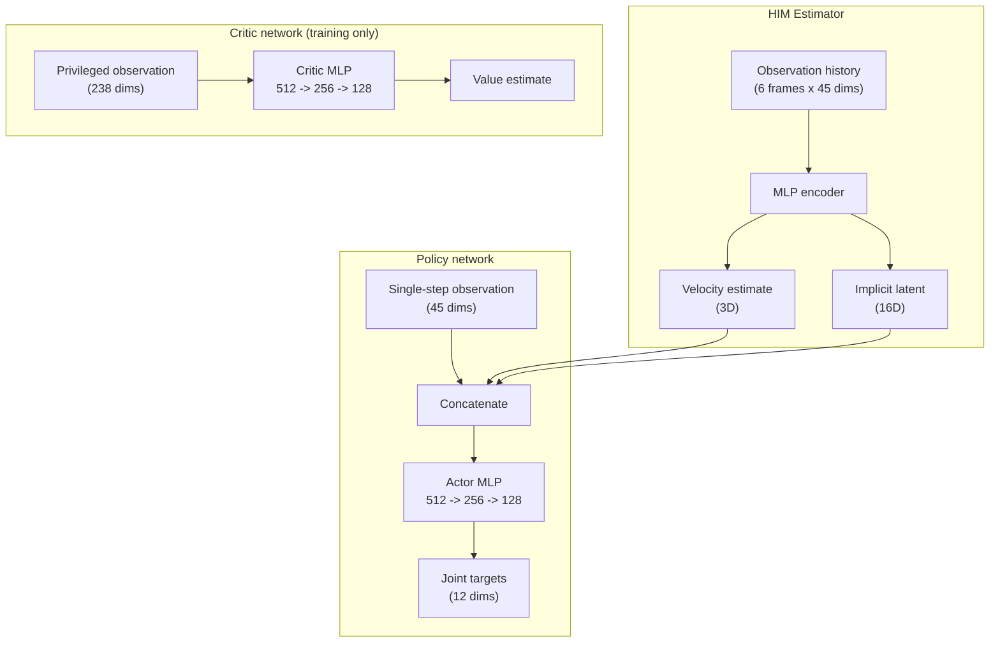
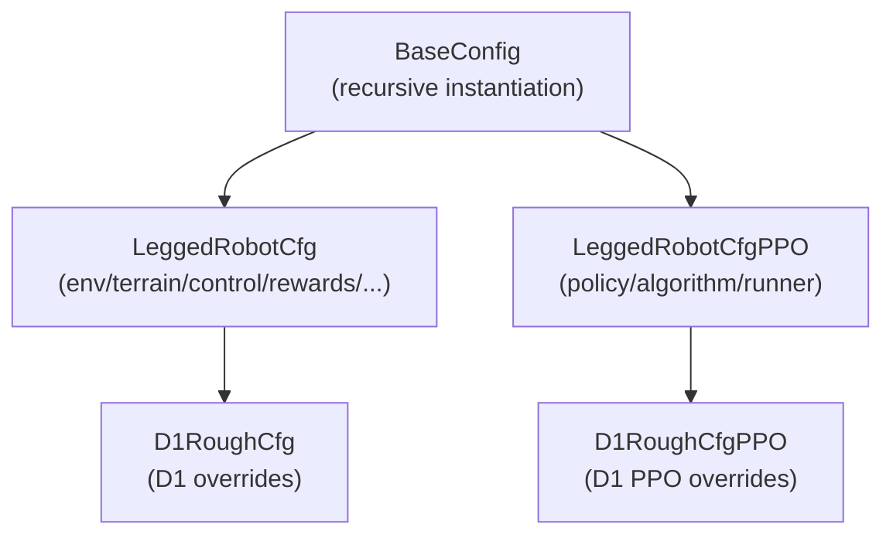

# Practical Quadruped Reinforcement Learning Training Based on HIMLoco

> **Goal**: Use the HIMLoco project as the training stack for Sim2Real reinforcement learning training and deployment on the Damiao Technology D1 quadruped robot.

HIMLoco (Hybrid Internal Model Locomotion) is an open-source quadruped locomotion control framework from OpenRobotLab, published at **ICLR 2024**. Its core idea is to avoid directly modeling terrain, friction, and other external environment factors. Instead, it uses a **Hybrid Internal Model (HIM)** to estimate velocity and implicit latent variables from the robot's own response, improving locomotion robustness.

---

## Table of Contents

- [Technical Background](#technical-background)
  - [Why HIMLoco](#why-himloco)
  - [Comparison with Related Methods](#comparison-with-related-methods)
- [HIMLoco Core Principles](#himloco-core-principles)
- [Repository Structure](#repository-structure)
- [Environment Setup](#environment-setup)
- [Configuration System](#configuration-system)
- [Training Workflow](#training-workflow)
- [Evaluation and Export](#evaluation-and-export)
- [Key Components](#key-components)
  - [Reward Functions](#reward-functions)
  - [Domain Randomization](#domain-randomization)
  - [Curriculum Learning](#curriculum-learning)
- [Adding a New Robot](#adding-a-new-robot)
- [FAQ](#faq)

Chinese documentation is available in [README_CN.md](README_CN.md).

---

## Technical Background

### Why HIMLoco

| Advantage | Description |
| --- | --- |
| **Minimal sensor requirements** | Only joint encoders and IMU are required; no depth camera or LiDAR is needed. |
| **Fast convergence** | Contrastive learning plus implicit modeling converges faster than explicit terrain estimation. |
| **Strong generalization** | The latent variable naturally captures perturbations such as friction, payload, and terrain changes. |
| **Clear code structure** | Built on ETH `legged_gym` and `rsl_rl`, with a mature community ecosystem. |

### Comparison with Related Methods

| Method | Core Method | Sensors | Characteristics |
| --- | --- | --- | --- |
| **HIMLoco** | HIM implicit estimation + contrastive learning | Encoders + IMU | Minimal sensors and strong generalization. |
| RMA (Ashish Kumar) | Explicit environment factor estimation | Encoders + IMU | Two-stage training with an adaptation module. |
| Walk These Ways | Gait parameterization + RL | Encoders + IMU | Strong controllability, but limited gait space. |
| DreamWaQ | Dreamer world model | Encoders + IMU + depth | High sample efficiency, but requires a depth camera. |
| Extreme Parkour | Teacher-student | Encoders + IMU + depth | Handles extreme motions, but has high hardware requirements. |

---

## HIMLoco Core Principles


### Internal Model Control (IMC)

Classic Internal Model Control assumes that **if the system response can be simulated accurately, external disturbances can be estimated without directly measuring the disturbances themselves**.

HIMLoco applies this idea to legged locomotion:

- Terrain height, friction coefficient, and payload changes -> treated as **external disturbances**.
- Robot joint feedback + IMU -> treated as the system's **observable response**.
- HIM Estimator -> estimates **velocity (3D)** and an **implicit latent variable (16D)** from the response.



### Training Objectives

The HIM Estimator is optimized with two losses:

| Loss | Role | Supervision Signal |
| --- | --- | --- |
| **Velocity MSE** | Explicit velocity estimation | Ground-truth base linear velocity from the simulator. |
| **Sinkhorn + Swap Loss** | Contrastive learning for the implicit latent variable | Next-step privileged critic observation, including terrain scans, external force, and related signals. |

> The key benefit of contrastive learning is that it does not require explicit labels for each perturbation type. The latent variable automatically encodes factors that affect robot response.

---

## Repository Structure

| Directory / File | Purpose | Key Output |
| --- | --- | --- |
| `legged_gym/envs/base/` | Base environment, config, rewards, and domain randomization | `legged_robot.py` |
| `legged_gym/envs/d1/` | D1-specific configuration overrides | `d1_config.py` |
| `legged_gym/scripts/` | Training and evaluation entry points | `train.py`, `play.py` |
| `legged_gym/resources/robots/` | URDF / MJCF robot assets | `d1_description.urdf` |
| `legged_gym/utils/` | Terrain generation, task registration, math utilities | `terrain.py`, `helpers.py` |
| `rsl_rl/algorithms/` | PPO / HIMPPO algorithms | `him_ppo.py` |
| `rsl_rl/runners/` | Training loop management | `him_on_policy_runner.py` |
| `rsl_rl/modules/` | Network architectures | `him_actor_critic.py`, `him_estimator.py` |
| `rsl_rl/storage/` | Rollout data storage | `him_rollout_storage.py` |
| `legged_gym/logs/` | Training logs and model checkpoints | `model_xxx.pt` |

### Registered Robot Tasks

| Task | Robot | URDF |
| --- | --- | --- |
| `d1` | Damiao Technology quadruped | `resources/robots/d1/urdf/d1_description.urdf` |
| `a1` | Unitree A1 | `resources/robots/a1/urdf/a1.urdf` |
| `go1` | Unitree Go1 | `resources/robots/go1/urdf/go1.urdf` |
| `aliengo` | Unitree AlienGo | `resources/robots/aliengo/urdf/aliengo.urdf` |

---

## Environment Setup

### 1. System Requirements

| Item | Version |
| --- | --- |
| **Operating system** | Ubuntu 22.04 |
| **NVIDIA driver** | >= 525.147.05 |
| **CUDA** | 12.0 |
| **Python** | 3.7.16 |
| **PyTorch** | 1.10.0+cu113 |
| **Isaac Gym** | Preview 4 |

> Isaac Gym Preview 4 must be downloaded separately from the [NVIDIA website](https://developer.nvidia.com/isaac-gym). It is not available on PyPI.

### 2. Create a Conda Environment

```bash
conda create -n himloco python=3.7.16
conda activate himloco
```

### 3. Install PyTorch

```bash
pip3 install torch==1.10.0+cu113 torchvision==0.11.1+cu113 torchaudio==0.10.0+cu113 \
    -f https://download.pytorch.org/whl/cu113/torch_stable.html
```

### 4. Install Isaac Gym

```bash
# Extract the downloaded Isaac Gym package first.
cd isaacgym/python && pip install -e .
```

Verify the installation:

```bash
python -c "import isaacgym; print('Isaac Gym OK')"
```

### 5. Install HIMLoco

```bash
git clone <this-repository-url>
cd HIMLoco

# Install rsl_rl (custom PPO + HIM algorithm).
cd rsl_rl && pip install -e .

# Install legged_gym (environment + configuration).
cd ../legged_gym && pip install -e .
```

> You must use the `legged_gym` and `rsl_rl` packages included in this repository instead of installing upstream versions from PyPI. This project contains many custom changes.

### 6. Verify the Installation

```bash
cd HIMLoco/legged_gym/legged_gym/scripts
python train.py --task=d1 --headless --max_iterations 10
```

If no error is raised and training logs are printed, the installation is ready.

---

## Configuration System

HIMLoco uses **nested Python classes** for configuration. Subclasses override base-class parameters through inheritance.



### Environment Configuration (LeggedRobotCfg)

| Config Block | Key Parameters | Description |
| --- | --- | --- |
| `env` | `num_envs=4096`, `num_one_step_observations=45` | Number of parallel environments and one-step observation dimension. |
| `terrain` | `mesh_type='trimesh'`, `curriculum=True` | Terrain type and terrain curriculum switch. |
| `commands` | `max_curriculum=1.4`, `heading_command=True` | Velocity command range and command curriculum. |
| `control` | `stiffness=70.0`, `damping=2.5`, `decimation=4` | PD control parameters and control frequency. |
| `asset` | `file='...d1_description.urdf'` | URDF path. |
| `domain_rand` | `randomize_motor_strength=True`, etc. | Domain randomization switches and ranges. |
| `rewards.scales` | `tracking_lin_vel=2.0`, `foot_slip=-0.05`, etc. | Reward term weights. |

### Training Configuration (LeggedRobotCfgPPO)

| Config Block | Key Parameters | Description |
| --- | --- | --- |
| `policy` | `actor_hidden_dims=[512,256,128]` | Actor/Critic network structure. |
| `algorithm` | `learning_rate=5e-4`, `schedule='adaptive'` | PPO hyperparameters. |
| `runner` | `max_iterations=10000`, `save_interval=300` | Training iterations and checkpoint save interval. |

### D1-Specific Overrides (`d1_config.py`)

D1 configuration only overrides parts that differ from the base configuration:

```python
class D1RoughCfg(LeggedRobotCfg):
    # Initial standing pose.
    class init_state:
        pos = [0.0, 0.0, 0.48]
        default_joint_angles = {
            'FL_hip_joint': 0.0, 'FL_thigh_joint': -0.7, 'FL_calf_joint': -1.0,
            'FR_hip_joint': 0.0, 'FR_thigh_joint': -0.7, 'FR_calf_joint': -1.0,
            'RL_hip_joint': 0.0, 'RL_thigh_joint': -0.5, 'RL_calf_joint': -1.0,
            'RR_hip_joint': 0.0, 'RR_thigh_joint': -0.5, 'RR_calf_joint': -1.0,
        }

    # PD control.
    class control:
        stiffness = {'joint': 70.0}
        damping = {'joint': 2.5}
        action_scale = 0.25
        hip_reduction = 0.5     # Limit hip abduction/adduction amplitude.

    # Reward weights.
    class rewards:
        class scales:
            tracking_lin_vel = 2.0
            feet_air_time = 0.5
            foot_slip = -0.05
            joint_pos_penalty = -0.12
            # See the config file for other terms.
```

---

## Training Workflow

### Start Training

```bash
cd HIMLoco/legged_gym/legged_gym/scripts

# Basic training. run_name is used to distinguish experiments.
python train.py --task=d1 --run_name test --num_envs 4096

# Specify the maximum iteration count.
python train.py --task=d1 --run_name test --num_envs 4096 --max_iterations 10000

# Headless mode, recommended for servers.
python train.py --task=d1 --run_name test --num_envs 4096 --headless
```

### Monitor Training

Open a new terminal and start TensorBoard:

```bash
tensorboard --logdir=HIMLoco/legged_gym/logs/rough_d1/
```

Open `http://localhost:6006` in your browser to inspect training curves.

**Key metrics**:

| Metric | Meaning | Healthy Trend |
| --- | --- | --- |
| `rew_tracking_lin_vel` | Linear velocity tracking reward | Rises steadily to 1.5+. |
| `rew_tracking_ang_vel` | Angular velocity tracking reward | Rises steadily. |
| `Estimation Loss` | HIM velocity estimation error | Decreases toward < 0.1. |
| `Swap Loss` | Contrastive learning loss | Decreases steadily. |
| `torque_saturation_rate` | Ratio of near-saturated torque steps | Check whether it exceeds 5%. |
| `terrain_level` | Terrain curriculum level | Increases gradually. |

### Resume Training

```bash
# Automatically load the latest checkpoint.
python train.py --task=d1 --resume

# Specify a checkpoint explicitly.
python train.py --task=d1 --resume --load_run=Mar19_15-24-58_ --checkpoint=3000
```

### Training Log Structure

```text
legged_gym/logs/rough_d1/
`-- Mar19_15-24-58_/                 # timestamp_run_name
    |-- model_300.pt                  # checkpoint at iteration 300
    |-- model_600.pt
    |-- model_900.pt
    |-- ...
    `-- events.out.tfevents.*         # TensorBoard logs
```

---

## Evaluation and Export

### Visual Evaluation

```bash
cd HIMLoco/legged_gym/legged_gym/scripts

# Default forward command: 1.0 m/s.
python play.py --task=d1

# To specify velocity, modify the parameters at the end of the script.
# play(args, x_vel=1.0, y_vel=0.0, yaw_vel=0.0)
```

`play.py` automatically:

1. Reduces the number of environments to 50 for easier rendering.
2. Disables noise and some domain randomization.
3. Loads the latest checkpoint.
4. Runs the policy on rough terrain.

### Export Models

When `EXPORT_POLICY = True` in `play.py`, policies are exported automatically:

```text
legged_gym/logs/rough_d1/exported/policies/
|-- policy.pt       # TorchScript JIT format for C++ deployment
`-- policy.onnx     # ONNX format for cross-platform inference
```

> The ONNX model can be deployed directly to embedded devices such as Jetson or RDK X5.

---

## Key Components

### Reward Functions

> Reward functions are defined in `legged_robot.py` and named as `_reward_<name>`.
> Execution order is determined by the alphabetical order returned by `dir()`, not by source-code order.

#### D1 Active Reward Terms

| Index | Reward Function | Weight | Purpose |
| --- | --- | --- | --- |
| 1 | `action_rate` | -0.15 | Penalizes rapid action changes. |
| 2 | `ang_vel_xy` | -0.08 | Penalizes roll/pitch angular velocity. |
| 3 | `base_height` | -3.0 | Penalizes deviation from target base height. |
| 4 | `collision` | -1.0 | Penalizes thigh, calf, and base collisions. |
| 5 | `dof_acc` | -1e-7 | Penalizes joint acceleration. |
| 6 | `dof_vel` | -0.01 | Penalizes joint velocity. |
| 7 | `feet_air_time` | +0.5 | Rewards reasonable swing duration. |
| 8 | `foot_clearance` | -0.01 | Penalizes insufficient foot lift. |
| 9 | `foot_slip` | -0.05 | Penalizes foot slip. |
| 10 | `joint_pos_penalty` | -0.12 | Penalizes hip deviation from default position. |
| 11 | `joint_power` | -2e-5 | Penalizes joint power. |
| 12 | `lin_vel_z` | -0.5 | Penalizes vertical base velocity. |
| 13 | `orientation` | -0.2 | Penalizes body tilt. |
| 14 | `smoothness` | -0.04 | Penalizes non-smooth actions. |
| 15 | `torques` | -1e-5 | Penalizes torque magnitude. |
| 16 | `tracking_ang_vel` | +0.5 | Main reward: angular velocity tracking. |
| 17 | `tracking_lin_vel` | +2.0 | Main reward: linear velocity tracking. |

> `only_positive_rewards = True` clips the final reward sum to >= 0, preventing an early training collapse spiral.

### Domain Randomization

> Domain randomization is resampled at each episode reset to improve Sim2Real transfer.

| Randomization Item | Range | Status |
| --- | --- | --- |
| Payload mass | [-1, 2] kg | Enabled |
| Center-of-mass offset | [-0.05, 0.05] m | Enabled |
| Ground friction coefficient | [0.2, 1.0] | Enabled |
| Kp gain | [0.9, 1.1]x | Enabled |
| Kd gain | [0.9, 1.1]x | Enabled |
| Joint armature | [0.8, 1.2]x | Enabled |
| **Motor torque limit** | **[0.9, 1.1]x** | **Enabled by scaling `torque_limits`** |
| External disturbance force | [-15, 15] N | Enabled |
| Push disturbance | Every 16 s, max 1 m/s | Enabled |
| Control delay | [0, decimation - 1] substeps | Enabled |
| Joint static friction | [0.8, 1.2] | Commented out in code; currently zero. |

### Curriculum Learning

Training uses two curricula:

**Terrain curriculum**: the robot trains on 10 terrain difficulty levels. Environments that traverse more than 70% of the terrain are promoted; frequently failing environments are demoted.

**Command curriculum**: the velocity command range expands gradually, up to `max_curriculum = 1.4 m/s`.

---

## Adding a New Robot

### 1. Prepare the URDF

Put the URDF and mesh files under:

```text
legged_gym/resources/robots/<robot_name>/urdf/<robot_name>.urdf
```

### 2. Create a Configuration File

```bash
# Create a new config directory.
mkdir legged_gym/legged_gym/envs/<robot_name>
```

Create `<robot_name>_config.py`:

```python
from legged_gym.envs.base.legged_robot_config import LeggedRobotCfg, LeggedRobotCfgPPO

class MyRobotCfg(LeggedRobotCfg):
    class init_state(LeggedRobotCfg.init_state):
        pos = [0.0, 0.0, 0.5]
        default_joint_angles = { ... }

    class asset(LeggedRobotCfg.asset):
        file = '{LEGGED_GYM_ROOT_DIR}/resources/robots/<robot_name>/urdf/<robot_name>.urdf'
        name = "<robot_name>"
        foot_name = "foot"

class MyRobotCfgPPO(LeggedRobotCfgPPO):
    class runner(LeggedRobotCfgPPO.runner):
        experiment_name = 'rough_<robot_name>'
```

### 3. Register the Task

Edit `legged_gym/legged_gym/envs/__init__.py`:

```python
from legged_gym.envs.<robot_name>.<robot_name>_config import MyRobotCfg, MyRobotCfgPPO

task_registry.register("<robot_name>", LeggedRobot, MyRobotCfg(), MyRobotCfgPPO())
```

### 4. Train

```bash
python train.py --task=<robot_name>
```

---

## FAQ

### Q1: Segmentation Fault

**Cause**: Isaac Gym does not have enough GPU contact pairs, or GPU memory is insufficient.

**Fixes**:

1. Increase `max_gpu_contact_pairs` (D1 default: `2**24`).
2. Reduce `num_envs`.
3. Confirm that the NVIDIA driver version is compatible with CUDA.

### Q2: Rewards Oscillate Violently or Collapse to Zero Early in Training

**Cause**: Policy collapse, usually caused by:

- An overly wide adaptive learning-rate range.
- Penalty weights that are too large, such as `action_rate` or `smoothness`.
- Domain randomization that is too strong.

**Fixes**:

```python
# Narrow the adaptive LR range.
# In him_ppo.py, raise the lower bound from 1e-5 to 1e-4
# and reduce the upper bound from 1e-2 to 5e-3.

# Reduce penalty terms.
rewards.scales.action_rate = -0.15   # was -0.23
rewards.scales.smoothness = -0.04    # was -0.08

# Enable positive reward clipping.
rewards.only_positive_rewards = True
```

### Q3: Resume Training Starts Again from Iteration 0

**Cause**: the `iter` field was not saved correctly in the checkpoint.

**Fix**: this has been fixed in `him_on_policy_runner.py`; the `save` method now records the current iteration correctly. If an old checkpoint has this issue, patch it manually:

```python
import torch
ckpt = torch.load('model_900.pt')
ckpt['iter'] = 900
torch.save(ckpt, 'model_900.pt')
```

### Q4: The Robot Cannot Stand Stably or the Legs Swing Outward Severely

**Cause**: hip action amplitude is too large.

**Fixes**:

- Reduce `control.hip_reduction`, for example from 1.0 to 0.5.
- Increase the `joint_pos_penalty` weight.

### Q5: `torque_saturation_rate` Is Always 0 in TensorBoard

**Explanation**: this means the joint torque never approaches the URDF torque limits. In that case, `motor_strength_factors` domain randomization (scheme B: scaling `torque_limits`) has limited effect.

**Options**:

- If stronger motor domain randomization is needed, use scheme A instead: scale the post-clip output.
- Or increase the randomization range to `[0.8, 1.2]`.

### Q6: How to Tell Whether Training Has Converged

**Watch these metrics**:

- `rew_tracking_lin_vel` is stable and greater than 1.5.
- `terrain_level` keeps increasing.
- `Estimation Loss` drops below 0.1.
- `mean_reward` no longer grows significantly.

> A run usually reaches initial convergence after 3000-5000 iterations. Around 10000 iterations can produce a stronger policy, depending on hardware and configuration.

---

## D1 Joint Configuration Reference

| Joint | Torque Limit (Nm) | Velocity Limit (rad/s) | Default Angle (rad) |
| --- | --- | --- | --- |
| `*_hip_joint` | 20.0 | 52.4 | 0.0 |
| `*_thigh_joint` (front legs) | 55.0 | 28.6 | -0.7 |
| `*_thigh_joint` (rear legs) | 55.0 | 28.6 | -0.5 |
| `*_calf_joint` | 55.0 | 28.6 | -1.0 |

> `*` represents FL / FR / RL / RR.

---

> **Documentation update log**
> - Based on the original HIMLoco (ICLR 2024) code with D1-specific customizations.
> - Includes contact-cache refactoring, motor-strength activation, `joint_pos_penalty` semantic correction, and related improvements.
> - Paper: [arXiv:2312.11460](https://arxiv.org/abs/2312.11460) | Project page: [junfeng-long.github.io/HIMLoco](https://junfeng-long.github.io/HIMLoco/)
