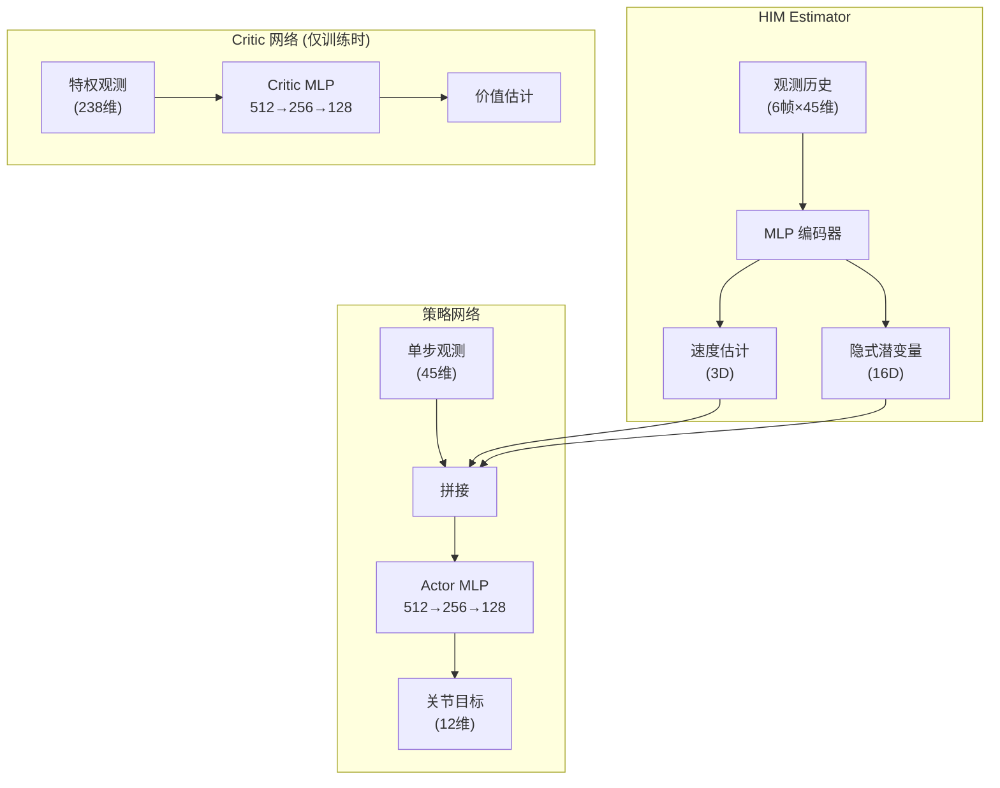
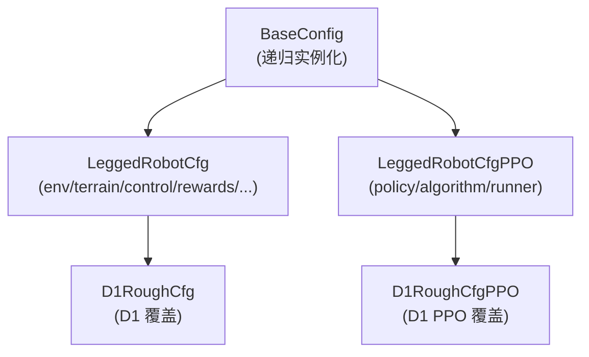

# 基于 HIMLoco 的四足强化学习训练实战

> **本文目标**：基于 HIMLoco 项目，使用达妙科技 (D1) 四足机器人进行 Sim2Real 强化学习训练与部署。

HIMLoco (Hybrid Internal Model Locomotion) 是上海人工智能实验室 (OpenRobotLab) 开源的四足运动控制框架，发表于 **ICLR 2024**。其核心思想是：不直接建模地形、摩擦等外部环境，而是通过**混合内部模型 (HIM)** 从机器人自身响应中估计速度和隐式潜变量，从而实现鲁棒的运动控制。

---

## 📑 目录

- [技术背景](#技术背景)
  - [为什么选 HIMLoco](#为什么选-himloco)
  - [同类方案对比](#同类方案对比)
- [HIMLoco 核心原理](#himloco-核心原理)
- [仓库结构预览](#仓库结构预览)
- [环境安装](#环境安装)
- [配置系统](#配置系统)
- [训练流程](#训练流程)
- [评测与导出](#评测与导出)
- [关键组件详解](#关键组件详解)
  - [奖励函数](#奖励函数)
  - [域随机化](#域随机化)
  - [课程学习](#课程学习)
- [添加新机器人](#添加新机器人)
- [常见问题 (FAQ)](#常见问题-faq)

---

## 技术背景

### 为什么选 HIMLoco

| 优势 | 说明 |
|------|------|
| **传感器需求极低** | 仅需关节编码器 + IMU，无需深度相机或激光雷达 |
| **收敛速度快** | 对比学习 + 隐式建模，比显式地形估计收敛更快 |
| **泛化能力强** | 隐式潜变量天然包含摩擦、负载、地形等扰动信息 |
| **代码结构清晰** | 基于 ETH legged_gym + rsl_rl，社区生态成熟 |

### 同类方案对比

| 方案 | 核心方法 | 传感器 | 特点 |
|------|----------|--------|------|
| **HIMLoco** | HIM 隐式估计 + 对比学习 | 编码器 + IMU | ⭐ 传感器最少，泛化强 |
| RMA (Ashish Kumar) | 显式环境因子估计 | 编码器 + IMU | 两阶段训练，需要 adaptation module |
| Walk These Ways | 步态参数化 + RL | 编码器 + IMU | 可控性强，但步态空间有限 |
| DreamWaQ | Dreamer 世界模型 | 编码器 + IMU + 深度 | 样本效率高，但需要深度相机 |
| Extreme Parkour | Teacher-Student | 编码器 + IMU + 深度 | 能做极端动作，但硬件要求高 |

---

## HIMLoco 核心原理


### 🔍 内部模型控制 (IMC) 思想

经典的内部模型控制 (Internal Model Control) 认为：**如果能准确模拟系统响应，就能估计出外部扰动，而无需直接测量扰动本身。**

HIMLoco 将这一思想应用于足式运动：

- 地形高度、摩擦系数、负载变化 → 统一视为**外部扰动**
- 机器人关节反馈 + IMU → 系统**可观测响应**
- HIM Estimator → 从响应中估计**速度 (3D)** + **隐式潜变量 (16D)**



### 🎯 训练目标

HIM Estimator 通过两个损失联合优化：

| 损失函数 | 作用 | 监督信号 |
|----------|------|----------|
| **Velocity MSE** | 显式速度估计 | 仿真器提供的真实基座线速度 |
| **Sinkhorn + Swap Loss** | 隐式潜变量对比学习 | 下一步的特权 Critic 观测（含地形扫描、外力等） |

> 💡 对比学习的关键好处：不需要为每种扰动类型设计显式标签，潜变量自动编码所有影响机器人响应的因素。

---

## 仓库结构预览

| 目录 / 文件 | 作用 | 关键产物 |
|-------------|------|----------|
| `legged_gym/envs/base/` | 基类环境、配置、奖励、域随机化 | `legged_robot.py` |
| `legged_gym/envs/d1/` | D1 专属配置覆盖 | `d1_config.py` |
| `legged_gym/scripts/` | 训练 / 评测入口 | `train.py`, `play.py` |
| `legged_gym/resources/robots/` | URDF / MJCF 模型资产 | `d1_description.urdf` |
| `legged_gym/utils/` | 地形生成、任务注册、数学工具 | `terrain.py`, `helpers.py` |
| `rsl_rl/algorithms/` | PPO / HIMPPO 算法 | `him_ppo.py` |
| `rsl_rl/runners/` | 训练循环管理 | `him_on_policy_runner.py` |
| `rsl_rl/modules/` | 网络架构 | `him_actor_critic.py`, `him_estimator.py` |
| `rsl_rl/storage/` | Rollout 数据存储 | `him_rollout_storage.py` |
| `legged_gym/logs/` | 训练日志与模型 checkpoint | **model_xxx.pt** |

### 已注册的机器人任务

| 任务名 | 机器人 | URDF |
|--------|--------|------|
| `d1` | 达妙科技四足 | `resources/robots/d1/urdf/d1_description.urdf` |
| `a1` | Unitree A1 | `resources/robots/a1/urdf/a1.urdf` |
| `go1` | Unitree Go1 | `resources/robots/go1/urdf/go1.urdf` |
| `aliengo` | Unitree AlienGo | `resources/robots/aliengo/urdf/aliengo.urdf` |

---

## 环境安装

### 1. 系统要求

| 项目 | 版本 |
|------|------|
| **操作系统** | Ubuntu 22.04 |
| **NVIDIA 驱动** | ≥ 525.147.05 |
| **CUDA** | 12.0 |
| **Python** | 3.7.16 |
| **PyTorch** | 1.10.0+cu113 |
| **Isaac Gym** | Preview 4 |

> ⚠️ Isaac Gym Preview 4 需要从 [NVIDIA 官网](https://developer.nvidia.com/isaac-gym) 单独下载，不在 PyPI 上。

### 2. 创建 Conda 环境

```bash
conda create -n himloco python=3.7.16
conda activate himloco
```

### 3. 安装 PyTorch

```bash
pip3 install torch==1.10.0+cu113 torchvision==0.11.1+cu113 torchaudio==0.10.0+cu113 \
    -f https://download.pytorch.org/whl/cu113/torch_stable.html
```

### 4. 安装 Isaac Gym

```bash
# 解压下载的 isaacgym 包
cd isaacgym/python && pip install -e .
```

验证安装：

```bash
python -c "import isaacgym; print('Isaac Gym OK')"
```

### 5. 安装 HIMLoco

```bash
git clone https://github.com/OpenRobotLab/HIMLoco.git
cd HIMLoco

# 安装 rsl_rl（自定义 PPO + HIM 算法）
cd rsl_rl && pip install -e .

# 安装 legged_gym（环境 + 配置）
cd ../legged_gym && pip install -e .
```

> ⚠️ **必须使用本仓库自带的 `legged_gym` 和 `rsl_rl`**，不要用 pip 安装上游版本，二者有大量定制修改。

### 6. 验证安装

```bash
cd HIMLoco/legged_gym/legged_gym/scripts
python train.py --task=d1 --headless --max_iterations 10
```

如果没有报错且输出了训练日志，则安装成功。

---

## 配置系统

HIMLoco 使用**嵌套 Python 类**作为配置，子类通过继承覆盖基类参数。



### 环境配置 (LeggedRobotCfg)

| 配置块 | 关键参数 | 说明 |
|--------|----------|------|
| `env` | `num_envs=4096`, `num_one_step_observations=45` | 并行环境数、单步观测维度 |
| `terrain` | `mesh_type='trimesh'`, `curriculum=True` | 地形类型、是否启用课程 |
| `commands` | `max_curriculum=1.4`, `heading_command=True` | 速度指令范围与课程 |
| `control` | `stiffness=70.0`, `damping=2.5`, `decimation=4` | PD 控制参数、控制频率 |
| `asset` | `file='...d1_description.urdf'` | URDF 路径 |
| `domain_rand` | `randomize_motor_strength=True`, 等 | 域随机化开关与范围 |
| `rewards.scales` | `tracking_lin_vel=2.0`, `foot_slip=-0.05`, 等 | 各奖励项权重 |

### 训练配置 (LeggedRobotCfgPPO)

| 配置块 | 关键参数 | 说明 |
|--------|----------|------|
| `policy` | `actor_hidden_dims=[512,256,128]` | Actor/Critic 网络结构 |
| `algorithm` | `learning_rate=5e-4`, `schedule='adaptive'` | PPO 超参数 |
| `runner` | `max_iterations=10000`, `save_interval=300` | 训练迭代数、保存频率 |

### D1 专属覆盖 (d1_config.py)

D1 配置仅覆盖与基类不同的部分：

```python
class D1RoughCfg(LeggedRobotCfg):
    # 初始站姿
    class init_state:
        pos = [0.0, 0.0, 0.48]
        default_joint_angles = {
            'FL_hip_joint': 0.0, 'FL_thigh_joint': -0.7, 'FL_calf_joint': -1.0,
            'FR_hip_joint': 0.0, 'FR_thigh_joint': -0.7, 'FR_calf_joint': -1.0,
            'RL_hip_joint': 0.0, 'RL_thigh_joint': -0.5, 'RL_calf_joint': -1.0,
            'RR_hip_joint': 0.0, 'RR_thigh_joint': -0.5, 'RR_calf_joint': -1.0,
        }
    # PD 控制
    class control:
        stiffness = {'joint': 70.0}
        damping = {'joint': 2.5}
        action_scale = 0.25
        hip_reduction = 0.5     # 限制髋关节外甩幅度
    # 奖励权重
    class rewards:
        class scales:
            tracking_lin_vel = 2.0   # 速度跟踪（主奖励）
            feet_air_time = 0.5      # 步态节奏
            foot_slip = -0.05        # 打滑惩罚
            joint_pos_penalty = -0.12 # 髋关节回正
            # ... 其他项见配置文件
```

---

## 训练流程

### 🚀 启动训练

```bash
cd HIMLoco/legged_gym/legged_gym/scripts

# 基本训练（run_name 用于区分不同实验）
python train.py --task=d1 --run_name test --num_envs 4096

# 指定最大迭代数
python train.py --task=d1 --run_name test --num_envs 4096 --max_iterations 10000

# 无头模式（无渲染，推荐服务器使用）
python train.py --task=d1 --run_name test --num_envs 4096 --headless
```

### 📊 监控训练

新开终端，启动 TensorBoard：

```bash
tensorboard --logdir=HIMLoco/legged_gym/logs/rough_d1/
```

浏览器打开 `http://localhost:6006` 查看训练曲线。

**关键指标**：

| 指标 | 含义 | 正常范围 |
|------|------|----------|
| `rew_tracking_lin_vel` | 速度跟踪奖励 | 持续上升至 1.5+ |
| `rew_tracking_ang_vel` | 角速度跟踪奖励 | 持续上升 |
| `Estimation Loss` | HIM 速度估计误差 | 持续下降至 < 0.1 |
| `Swap Loss` | 对比学习损失 | 持续下降 |
| `torque_saturation_rate` | 力矩饱和比例 | 观察是否 > 5% |
| `terrain_level` | 地形课程等级 | 逐步上升 |

### 🔄 断点恢复

```bash
# 自动加载最新 checkpoint
python train.py --task=d1 --resume

# 指定具体 checkpoint
python train.py --task=d1 --resume --load_run=Mar19_15-24-58_ --checkpoint=3000
```

### 训练日志结构

```
legged_gym/logs/rough_d1/
└── Mar19_15-24-58_/                 # 时间戳_运行名
    ├── model_300.pt                  # 第 300 轮 checkpoint
    ├── model_600.pt
    ├── model_900.pt
    ├── ...
    └── events.out.tfevents.*         # TensorBoard 日志
```

---

## 评测与导出

### 🎮 可视化评测

```bash
cd HIMLoco/legged_gym/legged_gym/scripts

# 默认前进 1.0 m/s
python play.py --task=d1

# 指定速度（需修改脚本末尾参数）
# play(args, x_vel=1.0, y_vel=0.0, yaw_vel=0.0)
```

`play.py` 会自动：
1. 减少环境数量到 50 个（方便渲染）
2. 关闭噪声和部分域随机化
3. 加载最新 checkpoint
4. 在粗糙地形上运行策略

### 📦 导出模型

`play.py` 中 `EXPORT_POLICY = True` 时，自动导出：

```
legged_gym/logs/rough_d1/exported/policies/
├── policy.pt       # TorchScript JIT 格式（C++ 部署）
└── policy.onnx     # ONNX 格式（跨平台推理）
```

> 💡 ONNX 模型可直接部署到嵌入式设备（如 Jetson、RDK X5 等）。

---

## 关键组件详解

### 奖励函数

> 奖励函数定义在 `legged_robot.py` 中，以 `_reward_<name>` 命名。
> 执行顺序由 `dir()` 字母序决定，**不是代码书写顺序**。

#### D1 当前生效的奖励项（按执行顺序）

| 序号 | 奖励函数 | 权重 | 作用 |
|------|----------|------|------|
| 1 | `action_rate` | -0.15 | 惩罚动作变化率 |
| 2 | `ang_vel_xy` | -0.08 | 惩罚横滚/俯仰角速度 |
| 3 | `base_height` | -3.0 | 惩罚偏离目标高度 |
| 4 | `collision` | -1.0 | 惩罚大腿/小腿/机身碰撞 |
| 5 | `dof_acc` | -1e-7 | 惩罚关节加速度 |
| 6 | `dof_vel` | -0.01 | 惩罚关节速度 |
| 7 | `feet_air_time` | +0.5 | 奖励合理的腾空时间 |
| 8 | `foot_clearance` | -0.01 | 惩罚抬脚不够高 |
| 9 | `foot_slip` | -0.05 | 惩罚脚底打滑 |
| 10 | `joint_pos_penalty` | -0.12 | 髋关节偏离默认位置惩罚 |
| 11 | `joint_power` | -2e-5 | 惩罚关节功耗 |
| 12 | `lin_vel_z` | -0.5 | 惩罚垂直方向速度 |
| 13 | `orientation` | -0.2 | 惩罚机身倾斜 |
| 14 | `smoothness` | -0.04 | 惩罚动作不平滑 |
| 15 | `torques` | -1e-5 | 惩罚力矩大小 |
| 16 | `tracking_ang_vel` | +0.5 | **主奖励**：角速度跟踪 |
| 17 | `tracking_lin_vel` | +2.0 | **主奖励**：线速度跟踪 |

> ⚠️ `only_positive_rewards = True` 会在所有项求和后裁剪到 ≥ 0，防止早期"死亡螺旋"。

### 域随机化

> 域随机化在每次 episode reset 时重新采样，增强 Sim2Real 迁移能力。

| 随机化项 | 范围 | 状态 |
|----------|------|------|
| 负载质量 | [-1, 2] kg | ✅ 生效 |
| 质心偏移 | [-0.05, 0.05] m | ✅ 生效 |
| 地面摩擦系数 | [0.2, 1.0] | ✅ 生效 |
| Kp 增益 | [0.9, 1.1]× | ✅ 生效 |
| Kd 增益 | [0.9, 1.1]× | ✅ 生效 |
| 关节 armature | [0.8, 1.2]× | ✅ 生效 |
| **电机力矩上限** | **[0.9, 1.1]×** | **✅ 已激活（缩放 torque_limits）** |
| 外部扰动力 | [-15, 15] N | ✅ 生效 |
| 推力扰动 | 每 16s，最大 1 m/s | ✅ 生效 |
| 控制延迟 | [0, decimation-1] 子步 | ✅ 生效 |
| 关节静摩擦 | [0.8, 1.2] | ⚠️ 代码被注释，当前为零 |

### 课程学习

训练使用两种课程：

**地形课程**：机器人在 10 级难度的地形上训练。成功走完地形 70% 长度的会升级，频繁摔倒的会降级。

**指令课程**：速度指令范围从小到大逐步扩展，最大到 `max_curriculum = 1.4 m/s`。

---

## 添加新机器人

### 1. 准备 URDF

将 URDF 文件和 mesh 放到：

```
legged_gym/resources/robots/<robot_name>/urdf/<robot_name>.urdf
```

### 2. 创建配置文件

```bash
# 新建配置目录
mkdir legged_gym/legged_gym/envs/<robot_name>
```

创建 `<robot_name>_config.py`：

```python
from legged_gym.envs.base.legged_robot_config import LeggedRobotCfg, LeggedRobotCfgPPO

class MyRobotCfg(LeggedRobotCfg):
    class init_state(LeggedRobotCfg.init_state):
        pos = [0.0, 0.0, 0.5]
        default_joint_angles = { ... }

    class asset(LeggedRobotCfg.asset):
        file = '{LEGGED_GYM_ROOT_DIR}/resources/robots/<robot_name>/urdf/<robot_name>.urdf'
        name = "<robot_name>"
        foot_name = "foot"

class MyRobotCfgPPO(LeggedRobotCfgPPO):
    class runner(LeggedRobotCfgPPO.runner):
        experiment_name = 'rough_<robot_name>'
```

### 3. 注册任务

编辑 `legged_gym/legged_gym/envs/__init__.py`：

```python
from legged_gym.envs.<robot_name>.<robot_name>_config import MyRobotCfg, MyRobotCfgPPO

task_registry.register("<robot_name>", LeggedRobot, MyRobotCfg(), MyRobotCfgPPO())
```

### 4. 训练

```bash
python train.py --task=<robot_name>
```

---

## 常见问题 (FAQ)

### Q1: 段错误 (Segmentation Fault)

**问题原因**：Isaac Gym 的 GPU 接触对数不够，或显存不足。

**解决办法**：

1. 增大 `max_gpu_contact_pairs`（D1 默认 `2**24`）
2. 减小 `num_envs`
3. 确认 NVIDIA 驱动版本与 CUDA 兼容

### Q2: 训练初期奖励剧烈震荡或快速归零

**问题原因**：策略崩溃 (Policy Collapse)，通常由以下原因导致：

- 自适应学习率范围过宽
- 惩罚项权重过大（如 `action_rate`、`smoothness`）
- 域随机化扰动过强

**解决办法**：

```python
# 收窄自适应 LR 范围
# him_ppo.py 中将 LR 下界从 1e-5 提高到 1e-4，上界从 1e-2 降低到 5e-3

# 降低惩罚项
rewards.scales.action_rate = -0.15   # 原 -0.23
rewards.scales.smoothness = -0.04    # 原 -0.08

# 启用正奖励裁剪
rewards.only_positive_rewards = True
```

### Q3: 恢复训练后迭代号从 0 开始

**问题原因**：checkpoint 保存时记录的 `iter` 字段不正确。

**解决办法**：已在 `him_on_policy_runner.py` 中修复——`save` 方法现在正确记录当前迭代号。如果旧 checkpoint 有此问题，可手动修正：

```python
import torch
ckpt = torch.load('model_900.pt')
ckpt['iter'] = 900
torch.save(ckpt, 'model_900.pt')
```

### Q4: 机器人站不稳或腿外甩严重

**问题原因**：髋关节动作幅度过大。

**解决办法**：

- 调小 `control.hip_reduction`（如从 1.0 降到 0.5）
- 增大 `joint_pos_penalty` 权重

### Q5: TensorBoard 中 `torque_saturation_rate` 始终为 0

**说明**：这表示关节力矩从未接近 URDF 定义的力矩上限。`motor_strength_factors` 的域随机化（方案 B：缩放 `torque_limits`）在此情况下效果有限。

**对策**：

- 如果需要更强的电机域随机化效果，可改用方案 A（缩放 clip 后输出）
- 或加大随机范围至 `[0.8, 1.2]`

### Q6: 如何判断训练是否收敛

**观察以下指标**：

- `rew_tracking_lin_vel` 稳定且 > 1.5
- `terrain_level` 持续上升
- `Estimation Loss` 降至 < 0.1
- `mean_reward` 不再明显增长

> 💡 一般 3000~5000 轮可以初步收敛，10000 轮可以获得较好的策略。具体取决于硬件和配置。

---

## D1 关节配置参考

| 关节名 | 力矩上限 (Nm) | 速度上限 (rad/s) | 默认角度 (rad) |
|--------|---------------|-----------------|----------------|
| `*_hip_joint` | 20.0 | 52.4 | 0.0 |
| `*_thigh_joint` (前腿) | 55.0 | 28.6 | -0.7 |
| `*_thigh_joint` (后腿) | 55.0 | 28.6 | -0.5 |
| `*_calf_joint` | 55.0 | 28.6 | -1.0 |

> `*` 代表 FL / FR / RL / RR 四条腿。

---

> 📝 **文档更新日志**
> - 基于 HIMLoco (ICLR 2024) 原始代码 + D1 定制修改
> - 已包含 contact cache 重构、motor_strength 激活、joint_pos_penalty 语义修正等优化
> - 论文：[arXiv:2312.11460](https://arxiv.org/abs/2312.11460) | 项目主页：[junfeng-long.github.io/HIMLoco](https://junfeng-long.github.io/HIMLoco/)
